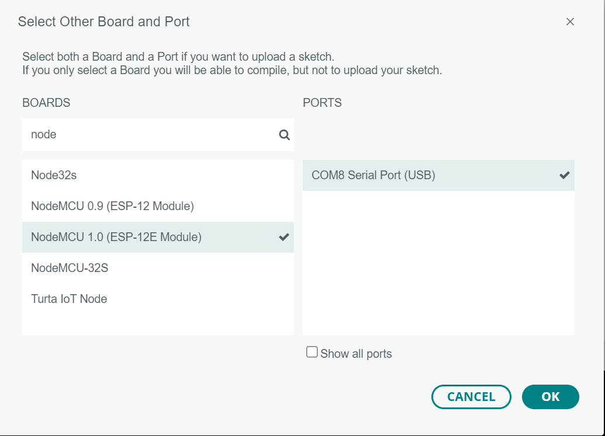

# Pantalla de Colores

La placa dentro de la pantalla es LoL1n new NodeMcu v3

- Instalar driver de CH340G: https://sparks.gogo.co.nz/ch340.html
- https://www.instructables.com/Getting-Started-With-ESP8266LiLon-NodeMCU-V3Flashi/

la pantalla está conectada al pin GPIO 4

## Placa y puerto en Arduino



El nombre de la placa es: NodeMCU (ESP-12E Module)

```cpp
#include <Adafruit_GFX.h>
#include <Adafruit_NeoMatrix.h>
#ifndef PSTR
  #define PSTR
#endif

#include <Adafruit_NeoPixel.h>
#ifdef __AVR__
  #include <avr/power.h>
#endif

#define PIN_DATOS    4
#define NUMERO_DE_PIXELES 192

// Argument 1 = Number of pixels in NeoPixel strip
// Argument 2 = Arduino pin number (most are valid)
// Argument 3 = Pixel type flags, add together as needed:
//   NEO_KHZ800  800 KHz bitstream (most NeoPixel products w/WS2812 LEDs)
//   NEO_KHZ400  400 KHz (classic 'v1' (not v2) FLORA pixels, WS2811 drivers)
//   NEO_GRB     Pixels are wired for GRB bitstream (most NeoPixel products)
//   NEO_RGB     Pixels are wired for RGB bitstream (v1 FLORA pixels, not v2)
//   NEO_RGBW    Pixels are wired for RGBW bitstream (NeoPixel RGBW products)
Adafruit_NeoPixel strip(NUMERO_DE_PIXELES, PIN_DATOS, NEO_GRB + NEO_KHZ800);

Adafruit_NeoMatrix matrix = Adafruit_NeoMatrix(8, 8, 3, 1, PIN_DATOS,
  NEO_TILE_TOP + NEO_TILE_LEFT + NEO_TILE_COLUMNS + NEO_TILE_PROGRESSIVE +
  NEO_MATRIX_TOP + NEO_MATRIX_LEFT + NEO_MATRIX_ROWS + NEO_MATRIX_PROGRESSIVE,
  NEO_GRB + NEO_KHZ800);

const uint16_t colors[] = {
  matrix.Color(255, 127, 0),
  matrix.Color(87, 35, 100),
  matrix.Color(0, 0, 255)
};

void setup() {
  Serial.begin(9600);
  // These lines are specifically to support the Adafruit Trinket 5V 16 MHz.
  // Any other board, you can remove this part (but no harm leaving it):
  #if defined(__AVR_ATtiny85__) && (F_CPU == 16000000)
    clock_prescale_set(clock_div_1);
  #endif
  // END of Trinket-specific code.
  matrix.begin();
  matrix.setTextWrap(false);
  matrix.setBrightness(150);
  matrix.setTextColor(colors[0]);
  
  strip.begin();            // INITIALIZE NeoPixel strip object (REQUIRED)
  strip.show();             // Turn OFF all pixels ASAP
  strip.setBrightness(255); // Set BRIGHTNESS to about 1/5 (max = 255)
}

/**
á String(char(160))
ó String(char(162))
ñ String(char(164))
*/
int x    = matrix.width();
int pass = 0;
boolean flag1 = true;
boolean flag2 = false;
String Frase0 = String(char(164));
String Frase1 = "Si la crisis lleva 20 a" + String(char(164)) + "os, tal vez ya no es una crisis.";
String Frase2 = "Los medios independientes no son obsoletos, tu iPhone s" + String(char(161)) + ".";
String Frase3 = "Esta revoluci" + String(char(162)) + "n no ser" + String(char(160)) + " silenciada.";
String Frase4 = "Somos la libertad de prensa que te prometieron.";
String Frase5 = "Dile al que te est" + String(char(160)) + " informando, que te est" + String(char(160)) + " mal informando.";
String Frase6 = "Inf" + String(char(162)) + "rmense, vagos.";
String Frase7 = "Los medios independientes no lloran, pero tampoco facturan.";
String Frase8 = "Siempre independiente, nunca inindependiente.";
String Frase9 = "Acabo de presentarme a mi convocatoria 1.000.000, abr" + String(char(160)) + "zame.";
String Frase10 = "Soy independiente y sensible";

/**
Si la crisis lleva 20 años, tal vez ya no es una crisis. 
Los medios independientes no son obsoletos, tu iPhone sí.
Esta revolución no será silenciada.
Somos la libertad de prensa que te prometieron.
Dile al que te está informando, que te está mal informando.
Infórmense, vagos.
Los medios independientes no lloran, pero tampoco facturan.
Siempre independiente, nunca inindependiente.
Acabo de presentarme a mi convocatoria 1.000.000, abrázame
Soy independiente y sensible
**/

void imprimirFrase(String frase, int indiceColor) {
  int longitud = frase.length();
  matrix.setTextColor(colors[indiceColor]);
  
  for(int i = matrix.width(); i> -longitud * 6; i--) {
    matrix.setCursor(--i, 0);
    matrix.fillScreen(0);
    matrix.print(frase);
    matrix.show();
    delay(120);
  }
}

void loop() {
  theaterChaseRainbow(30);
  imprimirFrase(Frase1, 0);
  imprimirFrase(Frase2, 1);
  imprimirFrase(Frase3, 2);
  imprimirFrase(Frase4, 0);
  imprimirFrase(Frase5, 1);
  imprimirFrase(Frase6, 2);
  imprimirFrase(Frase7, 0);
  imprimirFrase(Frase8, 1);
  imprimirFrase(Frase9, 2);
  imprimirFrase(Frase10, 0);
}


// Some functions of our own for creating animated effects -----------------

// Fill strip pixels one after another with a color. Strip is NOT cleared
// first; anything there will be covered pixel by pixel. Pass in color
// (as a single 'packed' 32-bit value, which you can get by calling
// strip.Color(red, green, blue) as shown in the loop() function above),
// and a delay time (in milliseconds) between pixels.
void colorWipe(uint32_t color, int wait) {
  for(int i=0; i<strip.numPixels(); i++) { // For each pixel in strip...
    strip.setPixelColor(i, color);         //  Set pixel's color (in RAM)
    strip.show();                          //  Update strip to match
    delay(wait);                           //  Pause for a moment
  }
}

// Theater-marquee-style chasing lights. Pass in a color (32-bit value,
// a la strip.Color(r,g,b) as mentioned above), and a delay time (in ms)
// between frames.
void theaterChase(uint32_t color, int wait) {
  for(int a=0; a<10; a++) {  // Repeat 10 times...
    for(int b=0; b<3; b++) { //  'b' counts from 0 to 2...
      strip.clear();         //   Set all pixels in RAM to 0 (off)
      // 'c' counts up from 'b' to end of strip in steps of 3...
      for(int c=b; c<strip.numPixels(); c += 3) {
        strip.setPixelColor(c, color); // Set pixel 'c' to value 'color'
      }
      strip.show(); // Update strip with new contents
      delay(wait);  // Pause for a moment
    }
  }
}

// Rainbow cycle along whole strip. Pass delay time (in ms) between frames.
void rainbow(int wait) {
  // Hue of first pixel runs 5 complete loops through the color wheel.
  // Color wheel has a range of 65536 but it's OK if we roll over, so
  // just count from 0 to 5*65536. Adding 256 to firstPixelHue each time
  // means we'll make 5*65536/256 = 1280 passes through this outer loop:
  for(long firstPixelHue = 0; firstPixelHue < 5*65536; firstPixelHue += 256) {
    for(int i=0; i<strip.numPixels(); i++) { // For each pixel in strip...
      // Offset pixel hue by an amount to make one full revolution of the
      // color wheel (range of 65536) along the length of the strip
      // (strip.numPixels() steps):
      int pixelHue = firstPixelHue + (i * 65536L / strip.numPixels());
      // strip.ColorHSV() can take 1 or 3 arguments: a hue (0 to 65535) or
      // optionally add saturation and value (brightness) (each 0 to 255).
      // Here we're using just the single-argument hue variant. The result
      // is passed through strip.gamma32() to provide 'truer' colors
      // before assigning to each pixel:
      strip.setPixelColor(i, strip.gamma32(strip.ColorHSV(pixelHue)));
    }
    strip.show(); // Update strip with new contents
    delay(wait);  // Pause for a moment
  }
}

// Rainbow-enhanced theater marquee. Pass delay time (in ms) between frames.
void theaterChaseRainbow(int wait) {
  int firstPixelHue = 0;     // First pixel starts at red (hue 0)
  for(int a=0; a<30; a++) {  // Repeat 30 times...
    for(int b=0; b<3; b++) { //  'b' counts from 0 to 2...
      strip.clear();         //   Set all pixels in RAM to 0 (off)
      // 'c' counts up from 'b' to end of strip in increments of 3...
      for(int c=b; c<strip.numPixels(); c += 3) {
        // hue of pixel 'c' is offset by an amount to make one full
        // revolution of the color wheel (range 65536) along the length
        // of the strip (strip.numPixels() steps):
        int      hue   = firstPixelHue + c * 65536L / strip.numPixels();
        uint32_t color = strip.gamma32(strip.ColorHSV(hue)); // hue -> RGB
        strip.setPixelColor(c, color); // Set pixel 'c' to value 'color'
      }
      strip.show();                // Update strip with new contents
      delay(wait);                 // Pause for a moment
      firstPixelHue += 65536 / 90; // One cycle of color wheel over 90 frames
    }
  }
}

```
